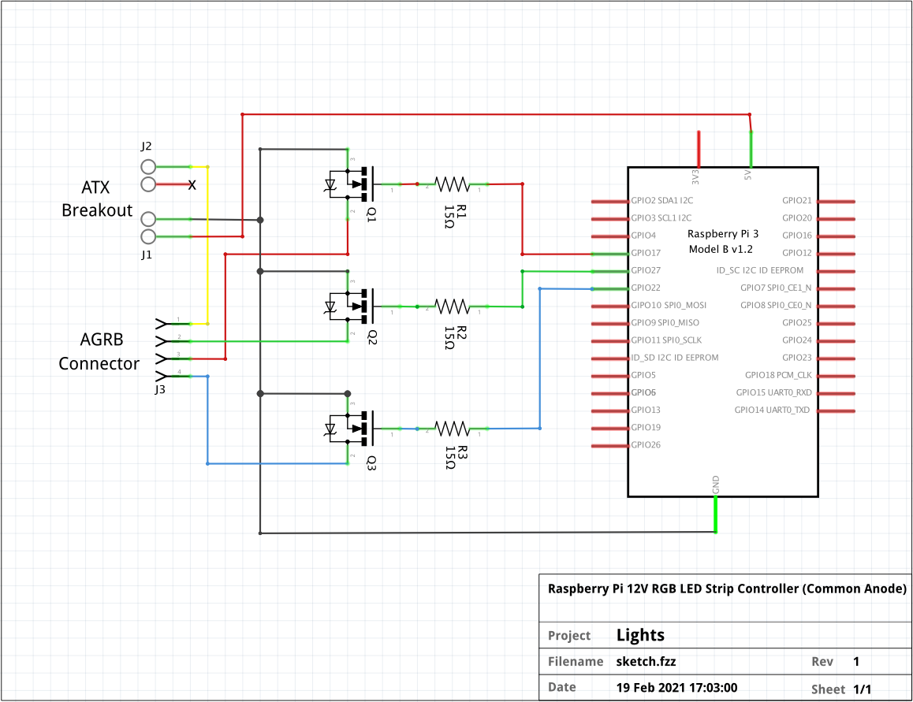
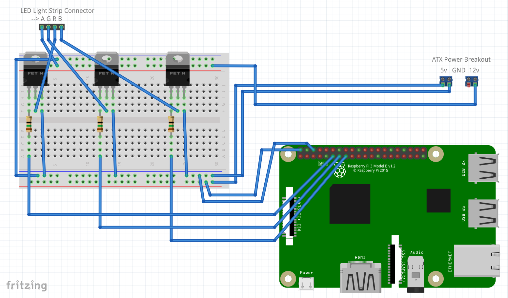

Lights!
=======

Controlling an RGB LED light strip over the network via a Raspberry Pi


Features
--------

* Should work with 12V common-anode RGB LED strips
* Web form for setting colors (color picker imported from [taufik-nurrohman/color-picker](https://github.com/taufik-nurrohman/color-picker), falls back to HTML5 color picker if no JavaScript)
* HTTP JSON API for setting colors, predefined patterns, or custom timed patterns
* UDP OSC API for setting colors or predefined patterns (tested from [Sonic Pi](https://sonic-pi.net))


Hardware
--------

***Note: I only know enough about electronics hardware to be dangerous. This could fry a Raspberry Pi given it is using an external (but regulated) non-USB power source or fry it for other reasons. It hasn't broken mine yet running all of the time but it is still quite possible. I'm not responsible if the hardware causes the magic blue smoke to leave your Raspberry Pi or summons demons that break your LED strip.***

### Parts Used

* 3x [N-channel MOSFETs](https://www.sparkfun.com/products/10213)
* 3x 15 Ω resistors (other small resistors would work; probably not required)
* 1x [ATX Power Connector Breakout Kit](https://www.sparkfun.com/products/15701)
* 1x [Raspberry Pi](https://www.sparkfun.com/categories/395) (tested with RPi 4B but other models should work)


### Schematic




### Breadboard View



Image generated with [Fritzing](https://fritzing.org)


Software
--------

A nightly Rust toolchain is required so using [rustup](https://rustup.rs) is recommended. Running `cargo run --release` will run the daemon, which includes a light pattern animation and output thread, HTTP server, and OSC server. In a deployment, the `static` and `templates` directories as well as the binary are the only artifacts needed.


API
---

### JSON

#### Endpoint: `/color`

##### Methods

| Method | Description                                                             |
| ------ | ----------------------------------------------------------------------- |
| `GET`  | Retrieve current color (including currently displayed color of pattern) |
| `PUT`  | Set a solid color                                                       |


##### Format

```
{
  "red": 0,
  "green": 169,
  "blue": 255
}
```


#### Endpoint: `/pattern`

##### Methods

| Method | Description              |
| ------ | ------------------------ |
| `GET`  | Retrieve current pattern |
| `PUT`  | Set a new pattern        |


##### Off Pattern Format

```
{
  "type": "off"
}
```


##### Solid Pattern Format

```
{
  "type": "solid",
  "content": {
    "red": 255,
    "green": 0,
    "blue": 195
  }
}
```


##### Custom Pattern Format

Durations are in milliseconds

```
{
  "type": "custom",
  "content": [
    {
      "color": {
        "red": 255,
        "green": 0,
        "blue": 137
      },
      "duration": 500
    },
    {
      "color": {
        "red": 0,
        "green": 140,
        "blue": 255
      },
      "duration": 500
    },
    {
      "color": {
        "red": 255,
        "green": 255,
        "blue": 255
      },
      "duration": 500
    }
  ]
}
```


### OSC

#### Address: `/color`

##### Arguments

Multiple formats accepted

```
red: int32
green: int32
blue: int32
```

```
red: float32
green: float32
blue: float32
```

```
red: float64
green: float64
blue: float64
```

```
color: rgba
```


#### Address: `/pattern/off`


##### Arguments

[no arguments]


#### Address: `/pattern/solid`

##### Arguments

Multiple formats accepted

```
red: int32
green: int32
blue: int32
```

```
red: float32
green: float32
blue: float32
```

```
red: float64
green: float64
blue: float64
```

```
color: rgba
```


### WebSocket

The WebSocket interface streams color updates to the client (which includes color updates as part of timed patterns) and supports receiving messages to set solid colors.

The URI to connect to the WebSocket can be retrieved by making a `GET` request to the `/wsinfo` endpoint. If the response from `/wsinfo` is empty, a default of `ws://<hostname>:8001/` should be assumed.


##### Format

```
{
  "red": 0,
  "green": 169,
  "blue": 255
}
```
